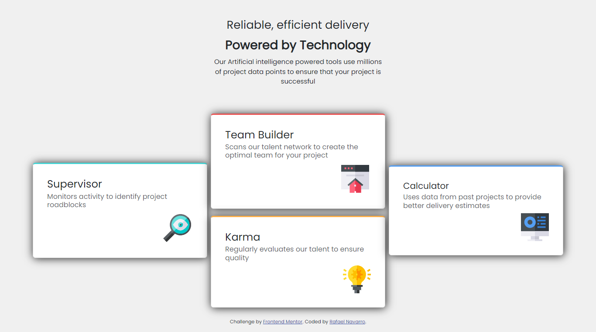

###### Desafio front-end mentor
# Projeto Quatro-Cards:
Projeto retirado do site 'FrontEnd Mentor' como um desafio para praticar as habilidades de desenvolvimento   
Tecnologias usadas no desenvolvimento: 
  
  
  
 

 
 
 

<!-- Proudly created with GPRM ( https://gprm.itsvg.in ) -->

